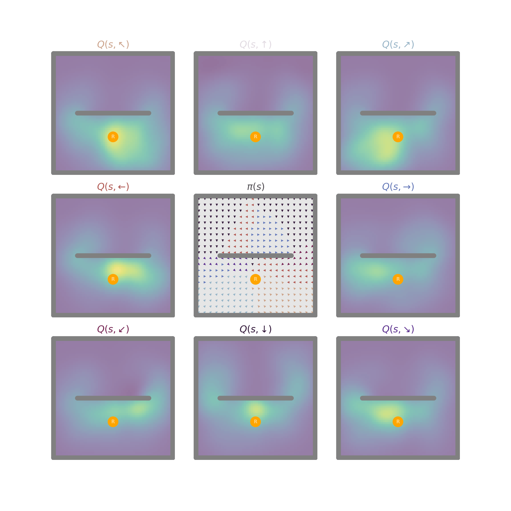

# **Neuro RL** 
## **University of Amsterdam Neuro-AI Summer School, 2024**
### made by: **Tom George (UCL) and Jesse Geerts (Imperial)**

In this tutorial we'll study and build reinforcement learning models inspired by the brain. By the end you'll understand, and be able to construct, a series of simple but surpringly powerful model of how agents learn to navigate in environment and find rewards.

Note: the colab renders better in Safari and Firefox than Chrome.

_Figure 1: An agent has learn to navigate around a wall towards a hidden reward using place cell state features and a simple Q-value learning algorithm._

## Topics covered: 
1. Rescorla-Wagner Model (~60 mins)
2. Temporal Difference Learning (~60 mins)
3. Q-Values and Policy Improvement (~60 mins)
4. State features and function approximation (~60 mins)
